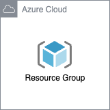

# Azure Resource Group Component

An Azure Resource Group container that holds related resources for an Azure solution. The resource group includes those resources that you want to manage as a group. You decide which resources belong in a resource group based on what makes the most sense for your organization.

This module creates:

- **Resource Group**: A container that holds related resources for an Azure solution.

## Architecture



## How to use this module

```terraform
module "rg" {
  source = "../terraform-components/azure-rg"

  resource_group_name     = "test-rg"
  resource_group_location = "eastus"

  tags = local.tags
}
```

<!-- BEGIN_TF_DOCS -->
## Requirements

| Name | Version |
|------|---------|
| <a name="requirement_terraform"></a> [terraform](#requirement\_terraform) | ~> 1.8.0 |
| <a name="requirement_azurerm"></a> [azurerm](#requirement\_azurerm) | ~> 3.107.0 |

## Providers

| Name | Version |
|------|---------|
| <a name="provider_azurerm"></a> [azurerm](#provider\_azurerm) | 3.107.0 |

## Modules

No modules.

## Resources

| Name | Type |
|------|------|
| [azurerm_resource_group.rg](https://registry.terraform.io/providers/hashicorp/azurerm/latest/docs/resources/resource_group) | resource |

## Inputs

| Name | Description | Type | Default | Required |
|------|-------------|------|---------|:--------:|
| <a name="input_resource_group_location"></a> [resource\_group\_location](#input\_resource\_group\_location) | The location/region of the resource group. | `string` | n/a | yes |
| <a name="input_resource_group_name"></a> [resource\_group\_name](#input\_resource\_group\_name) | The name of the resource group | `string` | n/a | yes |
| <a name="input_tags"></a> [tags](#input\_tags) | Custom tags which can be passed on to the Azure resources. They should be key value pairs having distinct keys. | `map(any)` | `{}` | no |

## Outputs

| Name | Description |
|------|-------------|
| <a name="output_location"></a> [location](#output\_location) | The Location of the deployed Resource Group |
| <a name="output_name"></a> [name](#output\_name) | The Name of the deployed Resource Group |
<!-- END_TF_DOCS -->
