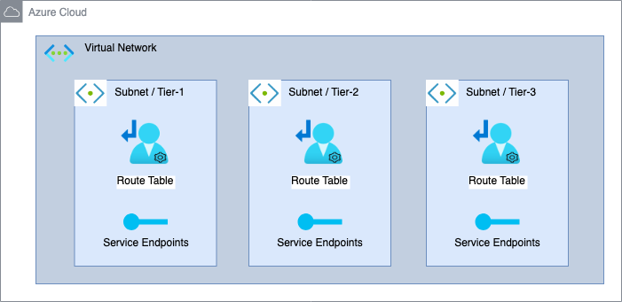

# Azure VNet Component

Azure Virtual Network (VNet) is a service that provides the fundamental building block for your private network in Azure. An instance of the service (a virtual network) enables many types of Azure resources to securely communicate with each other, the internet, and on-premises networks.

This module creates:

- **VNet and subnets** with public and private subnets
- **Route Tables**: To route traffic between the Vnet and the internet
- **Service Endpoints**: [Optional] To allow instances in private subnets to connect to Azure services without going through the internet

## Architecture



## Implementation decisions

### VNet and Subnets

This module creates a VNet with multiple subnets associated to multiple tiers. For example, in a typical web application, you might have a subnet for the load balancer, and subnets for the application servers, database servers, and cache servers, which has its own service tier.

Each subnet is associated with a dedicated route table that routes traffic to the internet if public-facing.

### Service Endpoinsts

You can optionally enable an S3 VPC endpoint to allow instances in private subnets to connect to S3 without going through the internet. This is useful for scenarios where you want to restrict access to S3 to only instances within the VPC.

## How to use this module

```terraform
module "vnet" {
  source = "path/to/terraform-components/azure-vnet"

  vnet_name       = "vnet-webapp"
  vnet_cidr_block = "10.1.0.0/16"
  tier_info = [
    {
      tier_name         = "application"
      cidr_blocks       = ["10.1.10.0/24"]
      public_facing     = true
      service_endpoints = ["Microsoft.KeyVault", "Microsoft.ContainerRegistry"]
    },
    {
      tier_name         = "database"
      cidr_blocks       = ["10.1.20.0/24"]
      public_facing     = false
      service_endpoints = ["Microsoft.Storage", "Microsoft.Sql"]
    }
  ]

  resource_group_name = module.network_resource_group.name
  location            = local.location
  tags                = local.tags
}
```

<!-- BEGIN_TF_DOCS -->
## Requirements

| Name | Version |
|------|---------|
| <a name="requirement_terraform"></a> [terraform](#requirement\_terraform) | ~> 1.8.0 |
| <a name="requirement_azurerm"></a> [azurerm](#requirement\_azurerm) | ~> 3.107.0 |

## Providers

| Name | Version |
|------|---------|
| <a name="provider_azurerm"></a> [azurerm](#provider\_azurerm) | 3.107.0 |

## Modules

No modules.

## Resources

| Name | Type |
|------|------|
| [azurerm_route_table.subnets](https://registry.terraform.io/providers/hashicorp/azurerm/latest/docs/resources/route_table) | resource |
| [azurerm_subnet.subnets](https://registry.terraform.io/providers/hashicorp/azurerm/latest/docs/resources/subnet) | resource |
| [azurerm_subnet_route_table_association.subnets](https://registry.terraform.io/providers/hashicorp/azurerm/latest/docs/resources/subnet_route_table_association) | resource |
| [azurerm_virtual_network.vnet](https://registry.terraform.io/providers/hashicorp/azurerm/latest/docs/resources/virtual_network) | resource |

## Inputs

| Name | Description | Type | Default | Required |
|------|-------------|------|---------|:--------:|
| <a name="input_enable_network_encryption"></a> [enable\_network\_encryption](#input\_enable\_network\_encryption) | Enable Virtual network encryption to encrypt Azure Virtual Machines traffic traveling within the virtual network.<br>Virtual machines must have accelerated networking enabled.<br>Traffic to public IP addresses is not encrypted. | `bool` | `false` | no |
| <a name="input_location"></a> [location](#input\_location) | The location/region to deploy all resources of this module into. | `string` | n/a | yes |
| <a name="input_resource_group_name"></a> [resource\_group\_name](#input\_resource\_group\_name) | The name of the resource group to deploy all resources of this module into. | `string` | n/a | yes |
| <a name="input_tags"></a> [tags](#input\_tags) | Custom tags which can be passed on to the Azure resources. They should be key value pairs having distinct keys. | `map(any)` | `{}` | no |
| <a name="input_tier_info"></a> [tier\_info](#input\_tier\_info) | The info blocks for the subnet structure for the tiers to deploy.<br>Each block respresents a tier should have tier\_name, cidr\_block, public\_facing, and service\_endpoints. | <pre>list(object({<br>    tier_name         = string<br>    cidr_blocks       = list(string)<br>    public_facing     = bool<br>    service_endpoints = list(string)<br>  }))</pre> | <pre>[<br>  {<br>    "cidr_blocks": [<br>      "10.0.1.0/24"<br>    ],<br>    "public_facing": true,<br>    "service_endpoints": [<br>      "Microsoft.KeyVault",<br>      "Microsoft.ContainerRegistry"<br>    ],<br>    "tier_name": "application"<br>  },<br>  {<br>    "cidr_blocks": [<br>      "10.0.2.0/24"<br>    ],<br>    "public_facing": false,<br>    "service_endpoints": [<br>      "Microsoft.Storage",<br>      "Microsoft.Sql"<br>    ],<br>    "tier_name": "database"<br>  }<br>]</pre> | no |
| <a name="input_vnet_cidr_block"></a> [vnet\_cidr\_block](#input\_vnet\_cidr\_block) | The CIDR block for the VPC | `string` | `"10.0.0.0/16"` | no |
| <a name="input_vnet_name"></a> [vnet\_name](#input\_vnet\_name) | The name of the virtual network | `string` | n/a | yes |

## Outputs

| Name | Description |
|------|-------------|
| <a name="output_subnets_names"></a> [subnets\_names](#output\_subnets\_names) | The Names of the deployed subnets. |
| <a name="output_vnet"></a> [vnet](#output\_vnet) | The Name of the deployed VPC |
<!-- END_TF_DOCS -->
